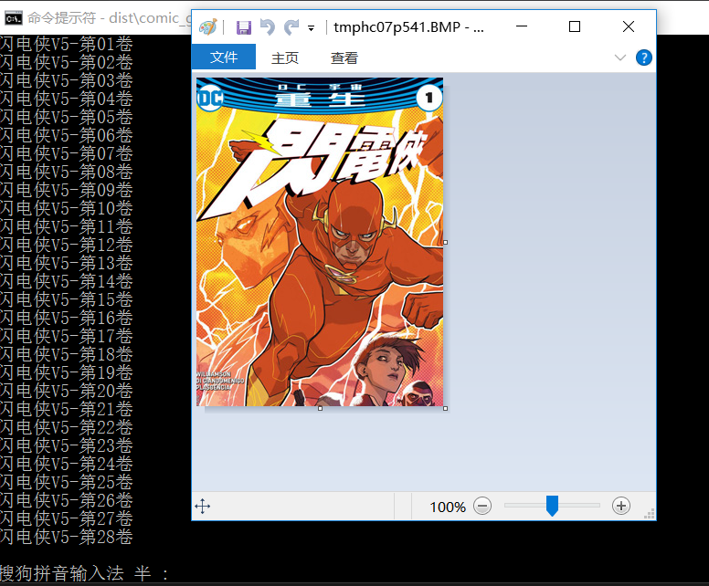
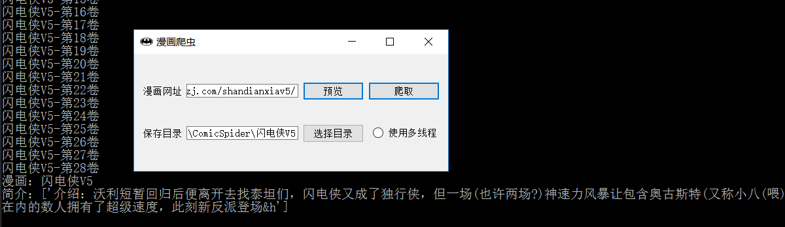
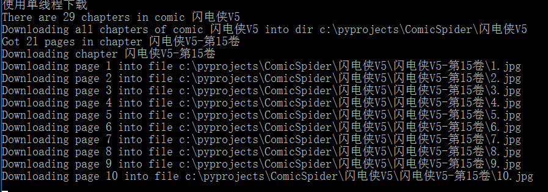
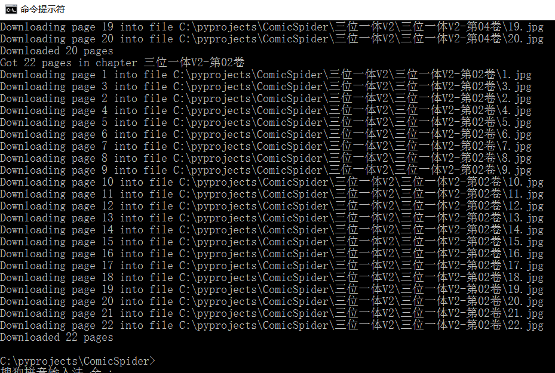
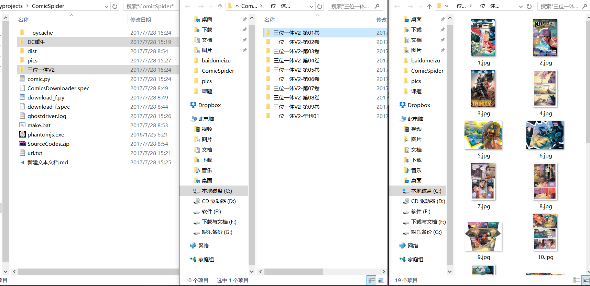

# ComicSpider
The first open-source crawler of raw comics images on [dmzj](http://manhua.dmzj.com/) website.  
第一个开源的[动漫之家](http://manhua.dmzj.com/)漫画站电脑版原图爬虫
# 尊重版权，只供爱好者研究使用，禁止商业用途，保留追究法律责任的权利
# Requirements依赖项
    python3,git  
    requests,phantomJS,selenium  
    optional:pyinstaller,PyQt5(for GUI)
# Description描述
The first open-source crawler of raw comics images on [dmzj](http://manhua.dmzj.com/) website.Used [PhantomJS](http://phantomjs.org/),and [selenuium](https://github.com/SeleniumHQ/selenium) to get the index of pages for each chapter of a comic.  Download and save the all pages to local files.  
The implementation of crawler's logic is in `comic.py`,you can develop your own crawler programs based on it.  
We provide a console crawler `download_f.py` and a GUI crawler `comic_gui.py`.  
And we also provide packaged win32/64 `.exe` programs.
  
第一个从[动漫之家](http://manhua.dmzj.com/)漫画站爬取电脑版原图的开源爬虫。使用[PhantomJS](http://phantomjs.org/),和 [selenuium](https://github.com/SeleniumHQ/selenium)获取每个漫画章节的分页索引。爬取并下载漫画图片到本地文件。  
爬虫逻辑实现在`comic.py`，功能完整，支持增量下载，可供开发者自行开发爬虫。  
提供命令行`download_f.py`和图形界面`comic_gui.py`两种爬虫程序。  
提供打包好的win32/64 `.exe`程序。  
# Usage使用  
## 中文版本:
安装依赖 。  
在命令行cmd或终端:  
    git clone https://github.com/QuantumLiu/ComicSpider.git  
下载 [PhantomJS](http://phantomjs.org/), 解压并将`phantomjs.exe`文件放在`.py`文件的同一个文件夹。或者把`phantomjs.exe`所在路径添加到环境变量`PATH`。  
如果需要使用二进制文件 (Windows)，请下载最新的 [releases](https://github.com/QuantumLiu/ComicSpider/releases).  
#### GUI版本：
使用源码：    
    python comic_gui.py  
或双击`comic_gui.exe`  
输入你想要爬取的漫画的地址  
  
如果点击`预览`可预览漫画封面及相关信息，并自动生成一个保存目录。  
  
  
可选择是否使用多线程。  
输入或点击`选择目录`来制定保存目录。  
点击`爬取`开始爬取漫画。  

#### 命令行版本：
请在 `ComicSpider/` 文件夹创建一个文本文件，并写入你要下载的漫画的网址。  
例如，将以下内容写入 `url.txt`:  
    http://manhua.dmzj.com/dcyuzhouchongsheng/  
    http://manhua.dmzj.com/sanweiyitiv2/  
  

那么程序将下载这两部漫画:  

  
在cmd/shell:  
    cd ComicSpider  
    python download_f.py url.txt 1  
有两个可选参数:  
第一个参数用来指定存放要下载的漫画地址的文本文件的路径，默认值为 './url.txt'.
最后一个参数用来指定是否使用多线程。'1' 即 'True' e其他的是 'False'.默认值 'False'.
运行结果:

如你所见，程序创建了一个漫画文件夹，里面是各个章节的文件夹，每个章节文件夹内存放每一页的jpg文件。    
或者使用二进制文件：  
双击 `comicspider_console.exe` 将以默认值运行。  
或者在 cmd/shell/.bat:  
    comicspider_console \<your file\> \<multi-threads flag\>  
## English version:
Install all dependencies.    
In cmd/shell:  
    git clone https://github.com/QuantumLiu/ComicSpider.git  
Download [PhantomJS](http://phantomjs.org/), and copy it to the same floder of `.py` files.Or add the path of the `phantomjs.exe` file to `PATH`.  
If you want to use the binary package, download the lastest [releases](https://github.com/QuantumLiu/ComicSpider/releases).  
#### GUI version：
From source codes:  
    python comic_gui.py  
Or click `comic_gui.exe`  
Type the urls of comics you want to download.  
  
If you click `预览` you can preview the cover and infos of the comic, and fill a auto-choice directory to save comic images.  
  
  
You can choose whether useing multi-threading.  
Type a directory or click `选择目录` to configure the save directory.   
Click `爬取` to start crawling.  

#### Console version：
Please create a text file in `ComicSpider/` and write the urls of comics you want to download.  
For example,write following urls in `url.txt`:  
    http://manhua.dmzj.com/dcyuzhouchongsheng/  
    http://manhua.dmzj.com/sanweiyitiv2/  
  

So the program will download those two comics:  

  
Download [PhantomJS](http://phantomjs.org/), and copy it to the same floder of .py files.Or add the path of the .exe file to PATH.  
Then in cmd/shell:  
    cd ComicSpider  
    python download_f.py url.txt 1
There are two arguments:  
First is used to configure the url text file,the default value is './url.txt'.
The last argument is weather using multi threads.'1' for 'True' else for 'False'.Deafult for 'False'.
Results:

As you see, the program collected a comic in one floder and below the floder are chapter floders, in each chapter floder there are .jpg files of all pages of the chapter.  
Or using packaged binary program:    
Double click `comicspider_console.exe` to run with deafult arguments. 
Or in cmd/shell/.bat:  
    comicspider_console \<your file\> \<multi-threads flag\>
# Packaging打包  
Require pyinstaller.  
run `make.bat`
# Future
更多可指定参数  
非阻塞显示图片  
基于itchat的微信扩展
